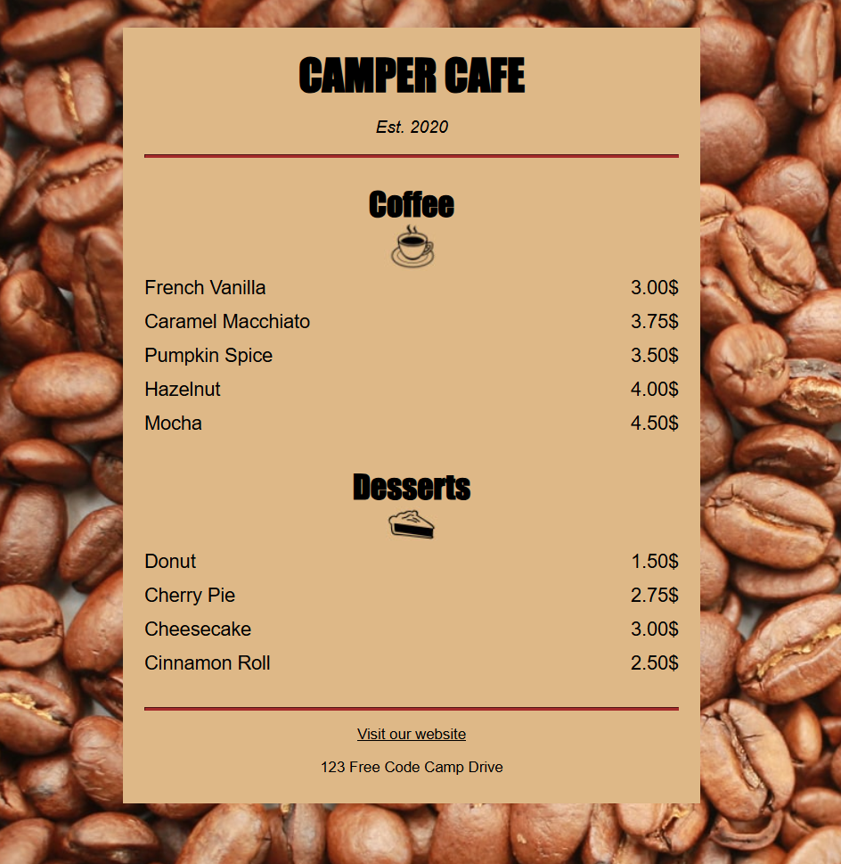

# coffee-shop-menu
# ☕ Coffee Shop Menu

A simple and elegant coffee shop menu built with HTML, CSS, and JavaScript. Browse categories, view item details, and filter items based on your cravings.

🔗 [Live Demo](https://shop-menu-rj.netlify.app/)

---

## ✨ Features

- 🧃 Filter menu items by category (e.g., breakfast, lunch, shakes)
- 📱 Responsive design for mobile and desktop
- ⚡ Fast and lightweight with zero frameworks
- 🎯 Clean and minimal UI

---

## 📸 Screenshots


---

## 🚀 Tech Stack

- HTML5
- CSS3
- JavaScript (Vanilla)

---

## 📁 Project Structure

```bash
coffee_shop_menu/
├── index.html
├── style.css
├── app.js
└── assets/
    └── images/
